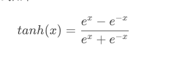

#### AI常用算法
* [线性回归](algorithms/line.md)
* [LSTM](algorithms/lstm.md)
* RNN

#### 常见小算法
基本都是numpy和其他数学、AI库里面的算法摘抄
* <font color="blue">`dot`</font>
  dot函数为numpy库下的一个函数，主要用于矩阵的乘法运算，其中包括：向量内积、多维矩阵乘法和矩阵与向量的乘法

  1、向量内积

```python
import numpy as np
b = np.array([2,3])
a = np.array([1,2])  
np.dot(a,b)
```
结果为：`8`,dot会将对应的数字相乘再将结果相加

  2. 矩阵乘法运算
  a 矩阵为 n * m ,b 一定为m * xxx 要注意的是注意 相同的这个m的顺序。换了就不行

```python
import numpy as np

a = np.array([[1, 2, 3],
   [3, 4, 5]])
b = np.array([[0, 1, 1, 1],
   [1, 2, 0, 1],
   [0, 0, 2, 1]])
result = np.dot(a, b)
print(result)
```
a是 2 \* 3，b是3 \* 4，第一 3要相同，第二3要在a，b中位置，换位置就不行。
np.dot(b,a) 是不可以的。

  3. 矩阵与向量乘法
  矩阵 a 为n * m,矩阵b为 m

```python
import numpy as np

a = np.array([[1, 2, 3],
   [3, 4, 5]])
b = np.array([1, 2, 3])
result = np.dot(a, b)
```
结果为n 维


* <font color="blue">`exp`</font>
exp，高等数学里以自然常数e为底的指数函数
Exp：返回e的n次方，e是一个常数为2.71828
Exp 函数 返回 e（自然对数的底）的幂次方。

```python
In [44]: np.exp(1)                                                                                                                                                                                          
Out[44]: 2.718281828459045

In [45]: np.exp(2)                                                                                                                                                                                          
Out[45]: 7.38905609893065

In [46]: np.exp(3)                                                                                                                                                                                          
Out[46]: 20.085536923187668

```


* <font color="blue">`sigmoid`</font>
Sigmoid函数是一个在生物学中常见的S型的函数，也称为S型生长曲线。Sigmoid函数常被用作神经网络的阈值函数，将变量映射到0,1之间。

```
def sigmoid(x):
    return 1.0/(1+np.exp(-x))
```

* <font color="blue">`softmax`</font>
softmax函数将任意n维的实值向量转换为取值范围在(0,1)之间的n维实值向量，并且总和为1。
做一个简单的例子
```python
import numpy as np
def softmax(x):
    x = x - np.max(x)
    expx = np.exp(x)
    softmaxx = expx / np.sum(expx)
    return softmaxx
print(softmax([100,50,23]))
```
结果为：[1.00000000e+00 1.92874985e-22 3.62514092e-34]


* <font color="blue">`tanh`</font>

```python
import numpy as np

def tanh(x):
    s1 = np.exp(x) - np.exp(-x)
    s2 = np.exp(x) + np.exp(-x)
    s = s1 / s2
    return s
```

#### Dropout
在机器学习的模型中，如果模型的参数太多，而训练样本又太少，训练出来的模型很容易产生过拟合的现象。在训练神经网络的时候经常会遇到过拟合的问题，过拟合具体表现在：模型在训练数据上损失函数较小，预测准确率较高；但是在测试数据上损失函数比较大，预测准确率较低。
* 参考 https://zhuanlan.zhihu.com/p/38200980
