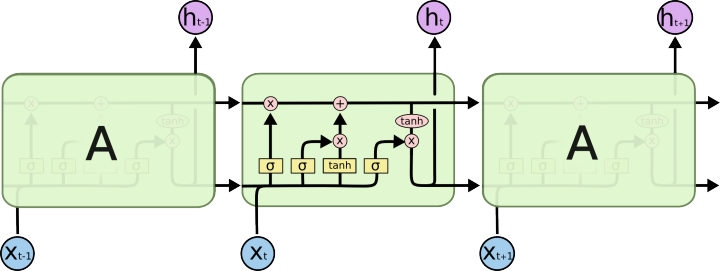
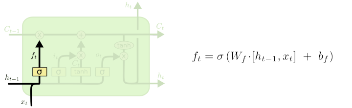
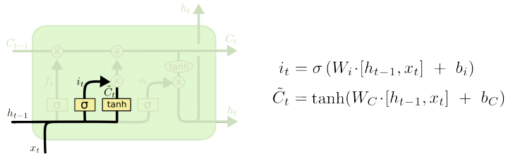
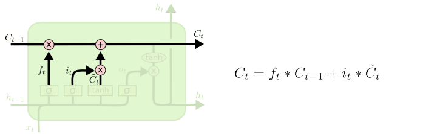
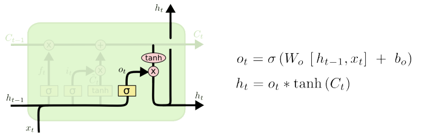

#### LSTM
长短期记忆（Long short-term memory, LSTM）是一种特殊的RNN(循环神经网络)，主要是为了解决长序列训练过程中的梯度消失和梯度爆炸问题。简单来说，就是相比普通的RNN，LSTM能够在更长的序列中有更好的表现。


#### LSTM解决了RNN的以下问题
* 梯度消失会导致我们的神经网络中前面层的网络权重无法得到更新，也就停止了学习。
* 梯度爆炸会使得学习不稳定， 参数变化太大导致无法获取最优参数。
* 在深度多层感知机网络中，梯度爆炸会导致网络不稳定，最好的结果是无法从训练数据中学习，最坏的结果是由于权重值为NaN而无法更新权重。
* 在循环神经网络（RNN）中，梯度爆炸会导致网络不稳定，使得网络无法从训练数据中得到很好的学习，最好的结果是网络不能在长输入数据序列上学习。

#### 应用领域
LSTM应用的领域包括：文本生成、机器翻译、语音识别、生成图像描述和视频标记等。

    * 2009年, 应用LSTM搭建的神经网络模型赢得了ICDAR手写识别比赛冠军。

    * 2015年以来，在机械故障诊断和预测领域，相关学者应用LSTM来处理机械设备的振动信号。

    * 2016年, 谷歌公司应用LSTM来做语音识别和文字翻译，其中Google翻译用的就是一个7-8层的LSTM模型。

    * 2016年, 苹果公司使用LSTM来优化Siri应用。

#### 原理和解释 文档
 在学习LSTM的算法过程中，发现很多文章和图片都来自以下链接，所以请大家先阅读这篇文档：
http://colah.github.io/posts/2015-08-Understanding-LSTMs/

知乎上的译文：
https://zhuanlan.zhihu.com/p/24018768

#### 例子代码
[战略家上的例子](http://www.zhanluejia.net.cn/zlj/question.html?questionid=5eddf8f9a4e0175b18806c73)

模拟了sin函数和股票预测

#### 手撕代码
看手撕代码前，你需要看 原理和解释的文档。

LSTMs 也有这种链式结构，但是这个重复模块与上面提到的RNNs结构不同：LSTMs并不是只增加一个简单的神经网络层，而是四个，它们以一种特殊的形式交互。



接下来的是算法四步走（附带numpy代码，也称作裸写）
  * 先计算出来三个门，都是sigmoid函数
  * 不要忘了还有个tanh这一项，就是个np.tanh()
  * 然后可以对隐状态（c_state）进行计算，需要计算四次，先乘，再加，再tanh，再乘
  * 收集每一次的输出 h


##### 第一步、遗忘门
LSTM的第一步就是决定什么信息应该被神经元遗忘。这是一个被称为“遗忘门层”的Sigmod层组成的。它输入 ht−1和xt,然后在Ct−1 的每个神经元状态输出0~1之间的数字。“1”表示“完全保留这个”，“0”表示“完全遗忘这个”。
让我们再次回到那个尝试去根据之前的词语去预测下一个单词的语言模型。在这个问题中，神经元状态或许包括当前主语中的性别信息，所以可以使用正确的代词。当我们看到一个新的主语，我们会去遗忘之前的性别信息。


```python
def sigmoid(x):
        s = 1.0 / (1.0 + np.exp(-x))
        return s

```

遗忘门
```python
# whh -> hidden to hidden
# wxh -> input to hidden
f=sigmoid(np.dot(h[t-1], whhf) + np.dot(x[t], wxhf) + bf)

```


##### 第二步、 输入门
下一步就是决定我们要在神经元细胞中保存什么信息，这包括两个部分。首先，一个被称为“输入门层”的Sigmod层决定我们要更新的数值。然后，一个tanh层生成一个新的候选数值，Ct˜,它会被增加到神经元状态中。在下一步中中，我们会组合这两步去生成一个更新状态值。
在那个语言模型例子中，我们想给神经元状态增加新的主语的性别，替换我们将要遗忘的旧的主语。


输入门

```python

i=sigmoid(np.dot(h[t-1], whhi) + np.dot(x[t], wxhi) + bi)
tanh = np.tanh(np.dot(h[t-1], whht) + np.dot(x[t], wxht) + bt)
```

##### 第三步、 输出门1
是时候去更新旧的神经元状态Ct−1到新的神经元状态Ct了。之前的步骤已经决定要做什么，下一步我们就去做。
我们给旧的状态乘以一个ft,遗忘掉我们之前决定要遗忘的信息，然后我们增加it∗Ct˜。这是新的候选值，是由我们想多大程度上更新每个状态的值来度量的。
在语言模型中，就像上面描述的，这是我们实际上要丢弃之前主语的性别信息，增加新的主语的性别信息的地方。


```python
c = f * c[t-1] + i * tanh
```

##### 第四步、 输出门2
最后，我们要决定要输出什么。这个输出是建立在我们的神经元状态的基础上的，但是有一个滤波器。首先，我们使用Sigmod层决定哪一部分的神经元状态需要被输出；然后我们让神经元状态经过tanh（让输出值变为-1~1之间）层并且乘上Sigmod门限的输出，我们只输出我们想要输出的。
对于那个语言模型的例子，当我们看到一个主语的时候，或许我们想输出相关动词的信息，因为动词是紧跟在主语之后的。例如，它或许要输出主语是单数还是复数的，然后我们就知道主语联结的动词的语态了。


```python

o = sigmoid(np.dot(h[t-1], whho) + np.dot(x[t], wxho) + bo)
h = np.tanh(c) * o
```


#### 使用 keras 做一个简单的趋势预测

代码如下

```python
from numpy import array
from keras.models import Sequential
from keras.layers import Dense
from keras.layers import LSTM
# prepare sequence
length = 5
seq = array([i/float(length) for i in range(length+1)])

X = seq[:-1].reshape(len(seq)-1, 1, 1)
y = seq[1:].reshape(len(seq)-1, 1)

T = seq[1:].reshape(len(seq)-1,1,1)

print("X",seq[:-1])
print("y",seq[1:])

# define LSTM configuration
n_neurons = length 
n_batch = length
n_epoch = 1000
# create LSTM
model = Sequential()
model.add(LSTM(n_neurons, input_shape=(1, 1)))
model.add(Dense(1))
model.compile(loss='mean_squared_error', optimizer='adam')
print(model.summary())
# train LSTM
model.fit(X, y, epochs=n_epoch, batch_size=n_batch, verbose=2)


# predict
print("original data",seq)

print("predict-1")
result = model.predict(T, batch_size=n_batch, verbose=0)
for value in result:
        print('%.1f' % value)

```

代码解释如下，

第一步： 准备数据

```python
X = seq[:-1].reshape(len(seq)-1, 1, 1)
y = seq[1:].reshape(len(seq)-1, 1)

#X [0.  0.2 0.4 0.6 0.8]
#y [0.2 0.4 0.6 0.8 1. ]
我们用线性数据 X 去训练，目标是y
目的就是让程序预测 1之后的数据是多少？
```

第二步： 建立模型
```python
model = Sequential()
model.add(LSTM(n_neurons, input_shape=(1, 1)))
model.add(Dense(1))
model.compile(loss='mean_squared_error', optimizer='adam')

建立了一个LSTM的模型，n_neurons 是内部的cell 用来表示hidden的大小
input_shape，是指 传的X，y的shape
```

第三步、 训练

```python
model.fit(X, y, epochs=n_epoch, batch_size=n_batch, verbose=2)

```

第四步、 预测
```python
result = model.predict(T, batch_size=n_batch, verbose=0)
#predict-1 ,能正确预测到 下一个是 1.2
0.4
0.6
0.8
1.0
1.2
```

#### 参考文档
1. https://zhuanlan.zhihu.com/p/32085405

  LSTM 如何解决RNN带来的梯度消失问题

2. https://zhuanlan.zhihu.com/p/136223550

3. https://zhuanlan.zhihu.com/p/44163528

  lstm gru 预测股票

4. https://www.kaggle.com/dpamgautam/stock-price-prediction-lstm-gru-rnn

 手写 lstm
5. http://blog.varunajayasiri.com/numpy_lstm.html